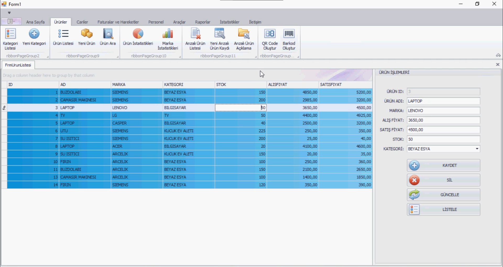

# 📊 DevExpress Prototype — Stock Tracking Application • (Archived)

 

## 📌 Project Overview

This project is a **stock tracking application prototype** developed with **DevExpress** components in a .NET environment.  
It was created to explore DevExpress UI capabilities and implement essential stock management features.  
It is based on Murat Yücedağ’s Udemy course project “C# ile DevExpress’te Teknik Servis ve Ürün Takip Sistemi”, adapted and implemented for practice.  
> 📦 **Archived** — This project is no longer being updated. It’s kept as part of my learning history and serves as a technical reference for future projects.

 

## 🖼️ Screenshots
Shown below in order:  
**1. Tasks**

  
  
  

 

## 🧰 Tech Stack

  
  
  

 

## 📜 License

This project is licensed under the terms described in the [LICENSE](./LICENSE) file.

---

© 2025 Yusuf Okan Sirkeci — [Hereetria](https://github.com/Hereetria)
